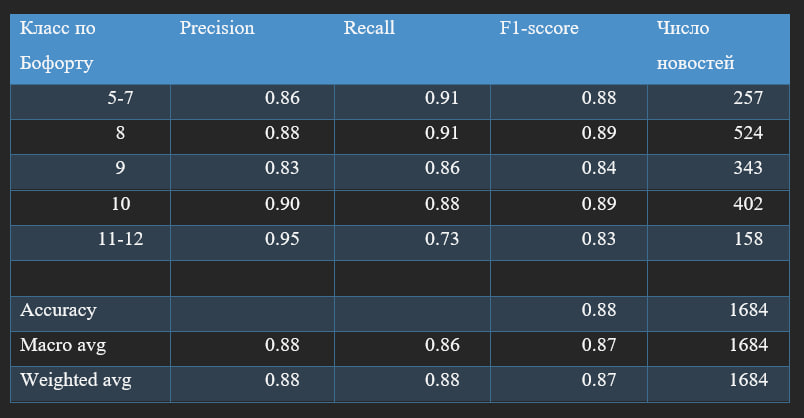

# База данных опасные природные явления
### 2018 - 2024 гг.

[Посмотреть веб-приложение](https://adaptation-bsvgjwiovzn6sm3afuq5co.streamlit.app/)

__________________________________________________
### 1. Обработка базы, визуализация атрибутов
[base_process](analysis/base_process.ipynb)

__________________________________________________
### 2. Корреляции
[correlations](analysis/correlations.ipynb)

__________________________________________________
### 3. Сильный ветер, интенсивность
[wind_intensity](analysis/wind_intensity.ipynb)

__________________________________________________
### 4. LDA и предсказание интенсивности Random Forest
[LDA-RF](analysis/LDA-RF.ipynb)

#### Классификация на 5 классов

#### Классификация на 8 классов

__________________________________________________
### 5. Предсказание интенсивности сильного ветра по тексту новости с помощью fine-tuning модели bert-base-uncased
[intensity-BERT](analysis/intensity-BERT.ipynb)

#### Классификация на 5 классов

#### Классификация на 8 классов

__________________________________________________
### 6. Фильтрация новостей на информативность для БД ОПЯ с помощью transfer-learning модели XLM-RoBERTa
[XLM-RoBERTa](analysis/XLM-RoBERTa.ipynb)

__________________________________________________
### 7. Верификация типа ОПЯ bart-large-mnli, FRIDA
[bart-frida](analysis/bart-frida.ipynb)

_________________________________________________
`Анискина Т.А., Деркачева А.А., Краев Г.Н., Сакиркина М.А. База данных "Опасные природные явления РФ по данным открытых источников" [Электронный ресурс] / Федеральное государственное автономное образовательное учреждение высшего образования «Национальный исследовательский университет «Высшая школа экономики», Москва. — 2024. — Свидетельство Роспатента о регистрации 2024625468`
